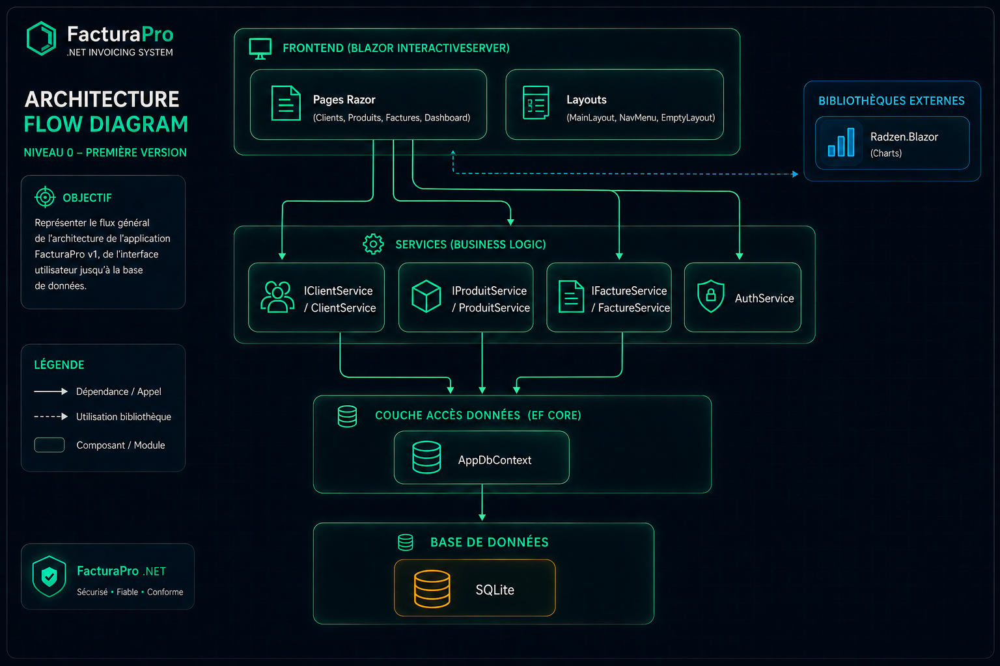
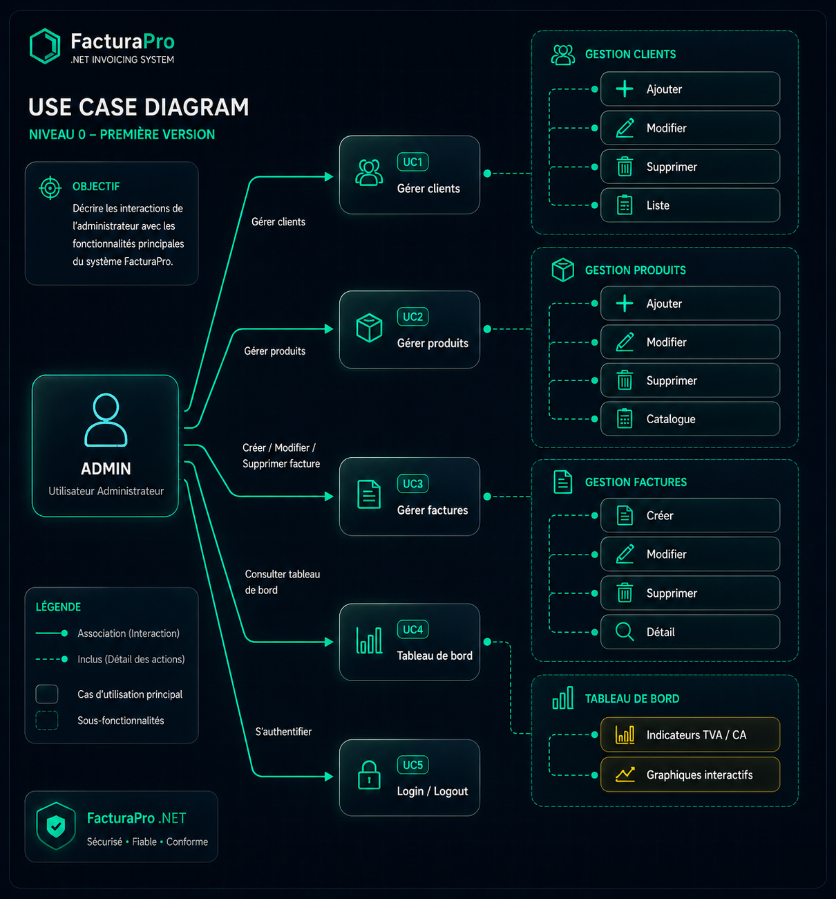
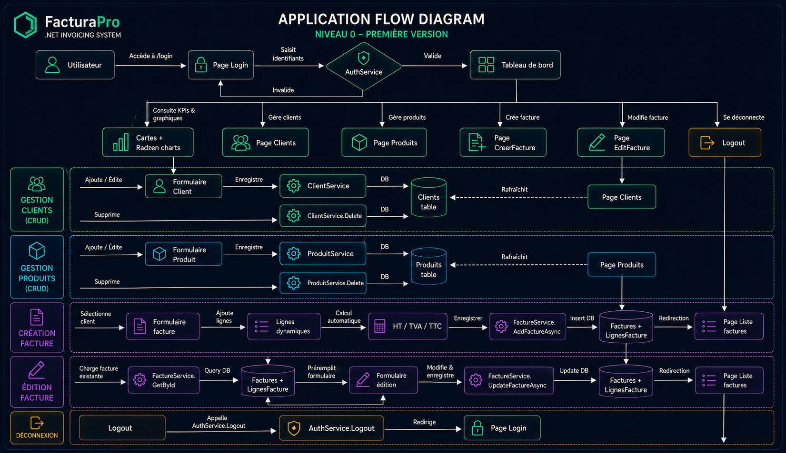
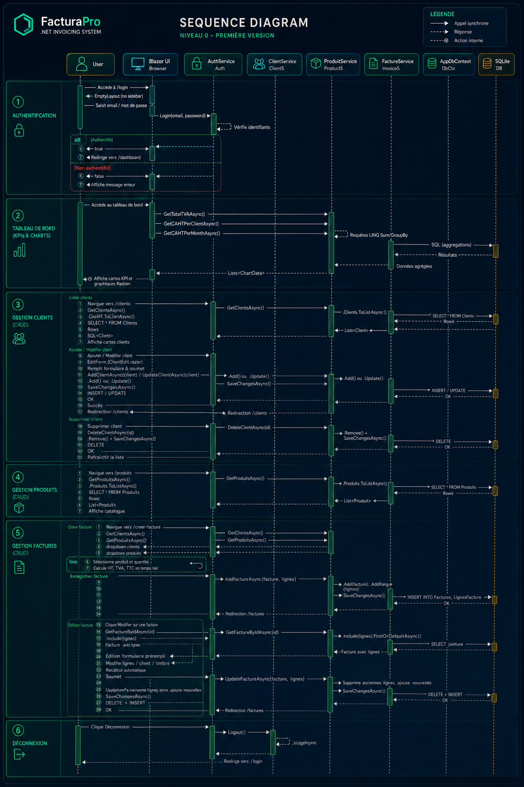

# 🧾 FacturaPro — Application de facturation tunisienne


**Auteurs :** Safa Belhouche (52%) · Fawz El Houda Ghalba (48%)  
**Technologie :** .NET 10 · Blazor Server · Entity Framework Core · SQLite · Radzen  
**Année :** 2025 · École Polytechnique de Sousse  
**🔗 Blueprint interactif :** [facturation-dotnet-project-blueprin.vercel.app](https://facturation-dotnet-project-blueprin.vercel.app/)


## 📌 Présentation

FacturaPro est une application web de facturation conforme au modèle tunisien (TVA, timbre fiscal, matricule fiscale).  
Elle permet de gérer des clients, des produits, de créer des factures et de visualiser des indicateurs fiscaux et commerciaux via un tableau de bord interactif.

Projet développé dans le cadre des **TP1 à TP9** du cours Programmation .NET C# sous la direction de **M. Saïd SASSI**.

| Pages Razor | Entités EF Core | Services DI | Charts Radzen | Méthodes async |
|:-----------:|:---------------:|:-----------:|:-------------:|:--------------:|
| **10** | **4** | **5** | **4** | **16** |


## ✨ Fonctionnalités

- **Gestion des clients** — création, édition, suppression, affichage en cartes avec avatar initiales et matricule fiscale.
- **Gestion des produits** — catalogue avec prix HT et taux TVA propre à chaque produit, toggle vue cartes/tableau, aperçu TTC live.
- **Gestion des factures** — création dynamique avec lignes, calcul automatique HT/TVA/TTC, timbre fiscal paramétrable, vue imprimable.
- **Tableau de bord** — 4 KPI cards + 5 graphiques Radzen : TVA par taux, CA HT/TTC client, évolution mensuelle, ventes produit, donut répartition.
- **Authentification** — `AuthService` Singleton, guard `MainLayout`, page `Login` avec `EmptyLayout`.


## 🔢 Concepts de facturation tunisienne

| Concept | Définition | Formule / Implémentation |
|---------|-----------|--------------------------|
| **HT** | Montant Hors Taxe — base de calcul | `Prix unitaire HT × Quantité` |
| **TVA** | Taxe sur la Valeur Ajoutée (19%, 13%, 7%) | `Montant HT × TauxTVA` |
| **TTC** | Toutes Taxes Comprises — montant ligne | `HT + TVA` |
| **Timbre fiscal** | Montant forfaitaire obligatoire par facture | `1.0 DT` — via `appsettings.json` |
| **Total TTC facture** | Montant final à payer par le client | `Σ(lignes TTC) + TimbreFiscal` |

> Tous ces calculs sont effectués en temps réel dans les entités (`LigneFacture`, `Facture`) et agrégés dans le tableau de bord via des requêtes LINQ asynchrones (`GroupBy`, `SumAsync`).


## 📐 Diagrammes

### 1. Diagramme d' Architecture


### 2. Diagramme des Cas d'Utilisation


### 2. Architecture Flow Diagram


### 3. Diagramme de Séquence Global



## 🧱 Architecture technique

```
InvoicingApp/
├── Data/
│   ├── Entities/          # Client · Produit · Facture · LigneFacture
│   └── EFCore/            # AppDbContext
├── Migrations/            # Migrations EF Core (Code-First)
├── Services/              # IClientService · IProduitService · IFactureService · AuthService · ITimbreFiscalService
├── Components/
│   ├── Layout/            # MainLayout · NavMenu · EmptyLayout
│   └── Pages/             # Login · Dashboard · Clients · Produits · Factures · CreerFacture · EditFacture · DetailFacture
├── wwwroot/               # CSS (facturapro.css) · images statiques
├── Program.cs             # DI · AddDbContext · AddScoped · AddRadzenComponents · Seeding
├── appsettings.json       # "TimbreFiscal": 1.0
└── README.md
```

| Couche | Technologie | Rôle |
|--------|-------------|------|
| **UI** | Blazor Server (InteractiveServer) | Pages Razor, EditForm, composants Radzen |
| **SVC** | Services C# Scoped/Singleton | CRUD + 11 méthodes analytiques LINQ |
| **DATA** | Entity Framework Core + SQLite | AppDbContext, migrations, relations FK |
| **AUTH** | AuthService (Singleton) | Login/Logout/IsLoggedIn, guard MainLayout |
| **CHARTS** | Radzen.Blazor | Column, Line, Donut |


## 🚀 Installation et exécution

```bash
# Cloner le dépôt
git clone https://github.com/SafaBelh/FacturaPro.git
cd FacturaPro

# Restaurer les packages
dotnet restore

# Appliquer les migrations (créer la base SQLite)
dotnet ef database update

# Lancer l'application
dotnet watch
```

Ouvrez `https://localhost:5001`  
Identifiants : `admin@facturapro.tn` / `admin123`

> Les données de démonstration (clients, produits, factures) sont **seedées automatiquement** au premier lancement.


## 🔧 Personnalisation

- **Timbre fiscal :** modifier `appsettings.json` → clé `"TimbreFiscal": 1.0`
- **Seeding :** données initiales dans `Program.cs` après `app.Build()`
- **Thème CSS :** variables dans `wwwroot/css/facturapro.css`
- **Compte admin :** modifier les identifiants dans `AuthService.cs`


## 🙏 Remerciements

Projet réalisé dans le cadre du module **Programmation .NET C#** à l'**École Polytechnique de Sousse** (2026).  
Merci à notre enseignant **M. Saïd SASSI** pour les TP structurés (TP1 à TP9).

---

## ⚖️ Licence

**Copyright © 2025 – Safa Belhouche & Fawz El Houda Ghalba – Tous droits réservés.**  
À usage pédagogique uniquement.